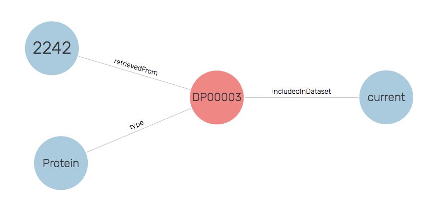

# Modelling Decision for DataRecord

Problems have been encountered when scraping data from three resources using the DataRecord profile to separate the metadata about the biological concept from the concept itself. This work was done in the context of the Intrinsically Disordered Protein BioHackathon [topic](https://github.com/elixir-europe/BioHackathon-projects-2020/tree/master/projects/24/) which was scraping data from DisProt, mobiDb, and ProteinEnsemble to generate an IDP Knowledge Graph.

To enable the idea of the DataRecord, a separate identifier is needed for the record from the biological resource, i.e. they need to be two separate nodes in the graph. The problems stem from the fact that most resources use the identifier for the biological resource to identify the webpage associated with the resource, and even when resources such as UniProt do implement this – using purl.uniprot.org identifiers for the proteins and www.uniprot.org identifiers for the webpage – others linking to that data often conflate the two. While this separation is logically correct and enables separate statements to be made about both, it is often not found in Schema.org deployments. Ultimately, this comes down to the web being a messy place and deployments often looking for the easiest way to get their markup on their site.

## Issue that arises

The [current deployment](disprot-DP00003-hashDR.jsonld) of DisProt (and the other resources) introduce a hash based identifier within the markup to represent the data record and separate it from the URL of the page which is used as the identifier for the protein. The following code snippet shows the relevant lines of markup in JSON-LD.
```json
{
  "@context": "https://schema.org",
  "@type": "DataRecord",
  "@id": "http://disport.org/DP00003#DR",
  "includedInDataset": "https://disprot.org/#2019_09",
  "mainEntity": {
    "@id": "http://disport.org/DP00003",
    "@type": "Protein"
  }
}
```
While this approach is consistent within itself, it becomes problematic when others link to it. For example, the scraping tool [BMUSE](https://github.com/HW-SWeL/BMUSE) adds provenance data to each scraped page so that there is a trail of where the data has been retrieved. This provenance uses the URL of the page that has been scraped. So for our example, that would be the following snippet.
```json
{
    "@id": "https://bioschemas.org/crawl/v1/disprot/DP00003/20201108/2242",
    "http://purl.org/pav/retrievedFrom": {
        "@id": "http://disprot.org/DP00003"
      },
    "http://purl.org/pav/retrievedOn": {
        "@value": "2020-11-08T21:20:09",
        "@type": "http://www.w3.org/2001/XMLSchema#dateTime"
      }
}
```
When this data is combined, we end up with the Protein being retrieved by BMUSE rather than the DataRecord as shown in the following figure.


## Possible Solutions

The problem arises from the webpage URL being used for the protein rather than the data record. However, we could conceive of some alternative approaches where different URLs are used.

### Identifiers.org

DisProt is registered with Identifiers.org, so we could use the Identifiers.org URL to represent the protein and the DisProt identifier for the data record as shown in the following snippet ([full example](disprot-DP00003-idorg.jsonld)).

```json
{
  "@context": "https://schema.org",
  "@type": "DataRecord",
  "@id": "http://disport.org/DP00003",
  "includedInDataset": "https://disprot.org/#2019_09",
  "mainEntity": {
    "@id": "https://identifiers.org/disprot:DP00003",
    "@type": "Protein"
  }
}
```

The downside of this approach is that the identifiers for the protein are no longer in the namespace, or control, of the data provider.

### `www` Subdomain

We could rely on the identifiers in the data not using the `www` subdomain and make a distinction between `http://www.disprot.org/DP00003` and `http://disprot.org/DP00003`. Again here is the relevant snippet ([full example](disport-DP00003-www.jsonld)).

```json
{
  "@context": "https://schema.org",
  "@type": "DataRecord",
  "@id": "http://www.disport.org/DP00003",
  "includedInDataset": "https://disprot.org/#2019_09",
  "mainEntity": {
    "@id": "http://disprot.org/DP00003",
    "@type": "Protein"
  }
}
```

This approach has the advantage that the namespaces are in the control of the data provider but is susceptible to confusion between the subdomain and the main namespace.

### Remove DataRecord

At present, we have no data particularly associated with the DataRecord resource or any consumption use case for retrieving data records. As such, we could simplify the markup and remove the `DataRecord` resource from the graph. The snipped would then be ([full example](disprot-DP00003-noDR.jsonld)).

```json
{
  "@context": "https://schema.org",
  "@type": "Protein",
  "@id": "http://disport.org/DP00003",
  "includedInDataset": "https://disprot.org/#2019_09"
}
```

An advantage of this approach is that it simplifies the deployed markup meaning that there more chance of accurate deployments and less of a training burden.

The following figure shows the resulting graph.



## Chosen Solution

Within the three data sources that we are considering in the IDP use case, the data record was added in for a notion of correctness rather than for any particular consumption need. 

To simplify the deployment, we are proposing to adopt the approach of no DataRecord.